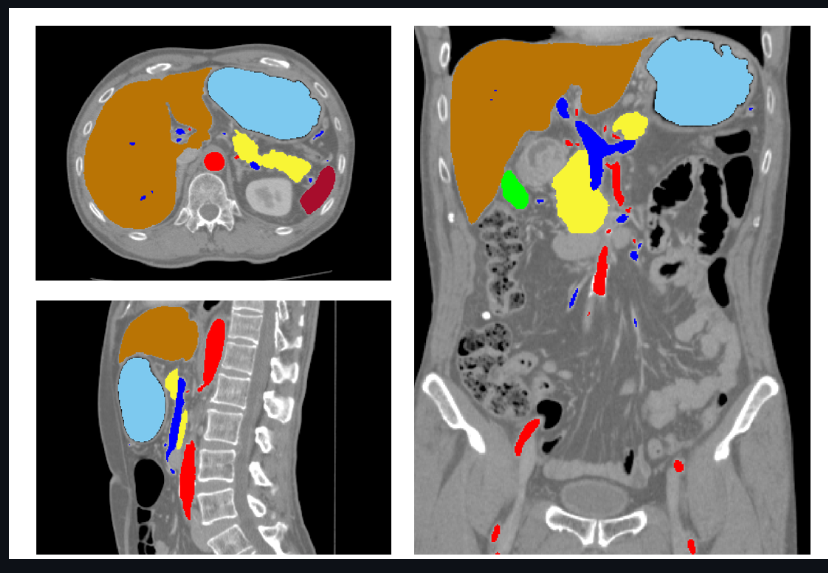

## Overview

This project demonstrates how to download a CT scan from The Cancer Imaging Archive (TCIA), load it in Python using MONAI, and then apply a pre-trained AI model to automatically segment multiple organs (e.g., liver, lungs, kidneys, bones, etc.). The approach demonstrates:

# Why Organ Segmentation Matters

Typically, a radiation oncologist or medical physicist might have manually contoured organs slice-by-slice, but AI-based approaches can automate and accelerate this process.

# How to Download Medical Data

We use tcia_utils to fetch a large CT volume (hundreds of megabytes) directly from TCIA.

# How to Use MONAI

MONAI is a PyTorch-based framework specifically for medical imaging: it provides transforms for loading DICOM, reorienting images, normalizing intensities, cropping, sliding-window inference, and more.

# Model Inference & Post-processing
Once the 3D CT is loaded, we run a pre-trained multi-organ segmentation model (the “wholeBody_ct_segmentation” from older versions of the MONAI Model Zoo or a local copy if the model is no longer hosted). We show how to obtain a labeled 3D mask, visualize it, and compute organ volumes.

The organ.ipynb notebook is a Python script designed for processing and analyzing medical imaging data. It uses a variety of packages to load, transform, and visualize this data, with a particular focus on DICOM files from CT scans (DICOMs from MRIs are quite different than CTs), which are a standard format for medical imaging data. 

The image below is from a detailed whole brain segmentation. It is an essential quantitative technique in medical image analysis, which provides a non-invasive way of measuring brain regions from a clinical acquired structural magnetic resonance imaging (it's not just CT imaging). 

Credit to:  Xin Yu (xin.yu@vanderbilt.edu) and Yinchi Zhou (yinchi.zhou@vanderbilt.edu) | Yucheng Tang (yuchengt@nvidia.com) 

## Commons Issues You Might Encounter

- Missing or Corrupted DICOM: Remove non-DICOM files from the folder of your downloaded CT images or pass only .dcm slices to LoadImage.
- “Kernel does not exist”: Means Jupyter was referencing an old kernel ID. Close existing notebooks, re-launch Jupyter from venv, or pick the correct kernel in the notebook UI.
- High Memory Usage: If you only have ~8 GB RAM, try a smaller CT dataset or reduce resolution. The model_lowres.pt is friendlier than model_final.pt.
- 404 or Missing Model: The wholeBody_ct_segmentation model might not be on NGC anymore. Manually clone from the MONAI Model Zoo dev branch. Also, you can use another trained model from monai's github page.
- No GPU: The code can run on CPU, though inference is slower. Make sure you remove or override lines in inference.json specifying device: cuda.

## Example Final Product:

In the image below you can detect plenty of segmented structures from the abdominal area.
There's the liver in brown, the spleen in dark red, the stomach in light blue, the gallbladder in green, the pancreas in yellow and the portal vein in navy blue.

